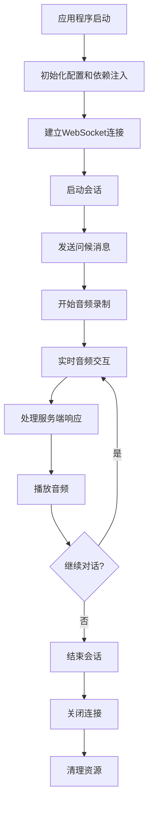

# RealtimeDialog .NET 9 项目需求文档

## 1. Product Overview
RealtimeDialog 是一个基于.NET 9的实时语音对话系统，通过WebSocket与火山引擎语音服务进行通信，使用NAudio进行音频处理，支持实时音频流的录制、发送、接收和播放功能。
- 解决实时语音交互的技术需求，为开发者提供完整的语音对话解决方案
- 目标用户：需要集成实时语音对话功能的.NET开发者和企业应用

## 2. Core Features

### 2.1 User Roles
本项目为开发者工具库，无需区分用户角色。

### 2.2 Feature Module
我们的RealtimeDialog .NET项目包含以下主要模块：
1. **主程序入口**：应用程序启动、配置管理、依赖注入容器配置
2. **协议处理模块**：二进制协议的序列化和反序列化、消息类型定义
3. **客户端请求模块**：WebSocket连接管理、会话管理、音频数据发送
4. **服务端响应模块**：消息接收处理、音频数据播放、事件响应
5. **音频处理模块**：基于NAudio的音频录制和播放功能
6. **测试项目**：单元测试和集成测试

### 2.3 Page Details

| 模块名称 | 组件名称 | 功能描述 |
|-----------|-------------|---------------------|
| 主程序入口 | Program.cs | 应用程序启动入口，配置依赖注入容器，初始化NAudio和WebSocket连接 |
| 主程序入口 | appsettings.json | 配置文件，包含API密钥、WebSocket地址等配置信息 |
| 协议处理模块 | BinaryProtocol.cs | 实现二进制协议的序列化和反序列化，支持多种消息类型和压缩方式 |
| 协议处理模块 | Message.cs | 定义消息结构，包含事件类型、会话ID、负载数据等 |
| 协议处理模块 | ProtocolEnums.cs | 定义协议相关的枚举类型，如消息类型、序列化方式、压缩方式 |
| 客户端请求模块 | ClientRequest.cs | 处理客户端请求，包括连接建立、会话启动、音频发送、连接关闭 |
| 客户端请求模块 | AudioSender.cs | 基于NAudio实现音频录制和实时发送功能 |
| 服务端响应模块 | ServerResponse.cs | 处理服务端响应消息，解析不同事件类型，管理音频播放 |
| 服务端响应模块 | AudioPlayer.cs | 基于NAudio实现音频播放功能，支持实时音频流播放 |
| 音频处理模块 | AudioConfig.cs | 音频配置类，定义采样率、声道数、格式等参数 |
| 音频处理模块 | AudioBuffer.cs | 音频缓冲区管理，支持线程安全的音频数据缓存 |
| 测试项目 | UnitTests | 单元测试，覆盖协议处理、音频功能等核心模块 |
| 测试项目 | IntegrationTests | 集成测试，测试完整的语音对话流程 |

## 3. Core Process

### 主要用户操作流程
1. **初始化阶段**：应用程序启动 → 加载配置 → 初始化依赖注入容器 → 初始化NAudio
2. **连接建立**：创建WebSocket连接 → 发送连接建立请求 → 接收连接确认响应
3. **会话管理**：发送会话启动请求 → 接收会话确认 → 发送问候消息
4. **音频交互**：启动音频录制 → 实时发送音频数据 → 接收服务端音频响应 → 播放音频
5. **会话结束**：发送会话结束请求 → 关闭WebSocket连接 → 清理资源

## 4. User Interface Design

### 4.1 Design Style
本项目为控制台应用程序和类库，无图形界面设计要求。
- 日志输出：使用结构化日志，支持不同级别的日志输出
- 控制台界面：简洁的文本输出，清晰的状态提示
- 配置文件：标准JSON格式，易于阅读和修改

### 4.2 Page Design Overview

| 模块名称 | 组件名称 | UI元素 |
|-----------|-------------|-------------|
| 控制台输出 | 日志显示 | 结构化日志输出，包含时间戳、日志级别、消息内容，支持彩色输出 |
| 配置文件 | appsettings.json | 标准JSON格式，包含嵌套配置结构，支持环境变量替换 |
| 测试界面 | 测试控制台 | 测试结果输出，包含测试用例名称、执行状态、耗时统计 |

### 4.3 Responsiveness
本项目为控制台应用程序，无响应式设计要求。重点关注跨平台兼容性，支持Windows、Linux、macOS平台运行。