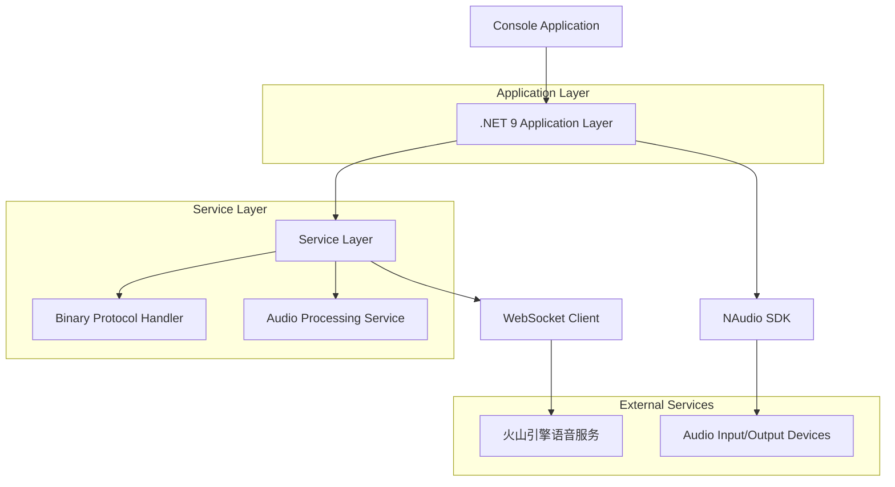
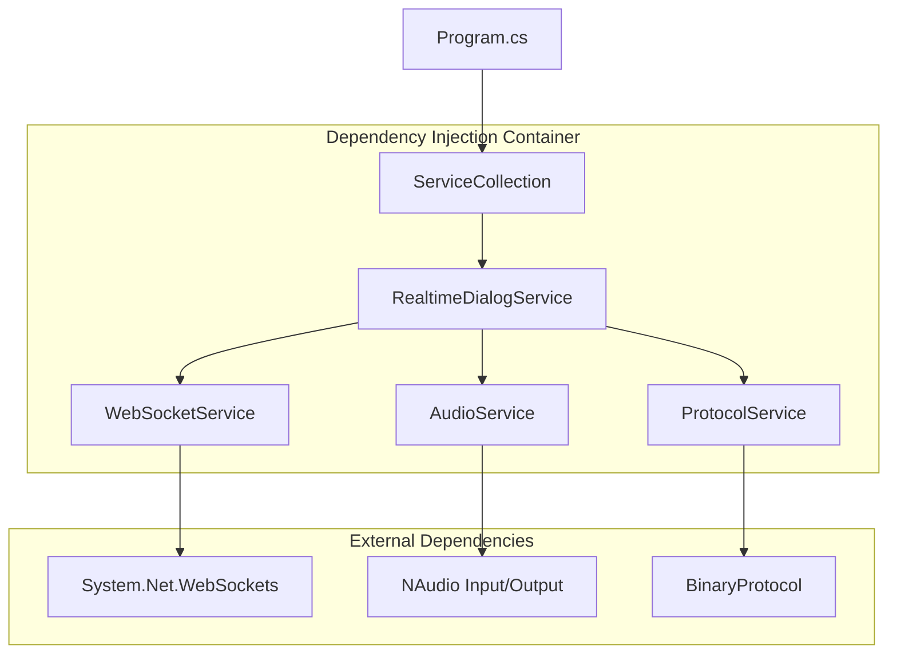
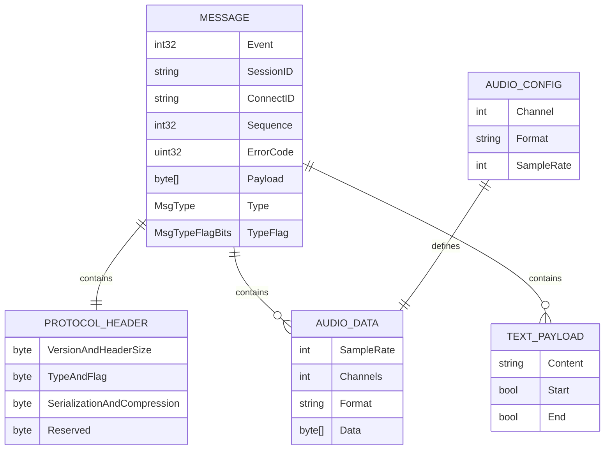

# RealtimeDialog .NET 9 技术架构文档

## 1. Architecture design



## 2. Technology Description

* Frontend: Console Application (.NET 9)

* Audio: NAudio

* WebSocket: System.Net.WebSockets (Built-in)

* Serialization: System.Text.Json\@8.0.0

* Logging: Microsoft.Extensions.Logging\@8.0.0

* DI Container: Microsoft.Extensions.DependencyInjection\@8.0.0

* Configuration: Microsoft.Extensions.Configuration\@8.0.0

* Testing: xUnit\@2.6.0 + Moq\@4.20.0

## 3. Route definitions

本项目为控制台应用程序，无HTTP路由。主要的程序流程如下：

| 流程阶段        | 目的                     |
| ----------- | ---------------------- |
| /startup    | 应用程序启动，初始化依赖注入容器和配置    |
| /connect    | 建立WebSocket连接到火山引擎语音服务 |
| /session    | 启动语音对话会话               |
| /audio-loop | 音频录制和播放的主循环            |
| /cleanup    | 清理资源和关闭连接              |

## 4. API definitions

### 4.1 Core API

#### WebSocket消息协议

**连接建立**

```
WebSocket Binary Message
```

Request:

| 参数名称    | 参数类型    | 是否必需 | 描述              |
| ------- | ------- | ---- | --------------- |
| Event   | int32   | true | 事件类型，连接建立为1     |
| Payload | byte\[] | true | JSON格式的空对象 "{}" |

Response:

| 参数名称      | 参数类型    | 描述             |
| --------- | ------- | -------------- |
| Event     | int32   | 响应事件类型，连接成功为50 |
| ConnectID | string  | 连接标识符          |
| Payload   | byte\[] | 连接确认信息         |

**会话启动**

```
WebSocket Binary Message
```

Request:

| 参数名称      | 参数类型    | 是否必需 | 描述                          |
| --------- | ------- | ---- | --------------------------- |
| Event     | int32   | true | 事件类型，会话启动为100               |
| SessionID | string  | true | 会话标识符                       |
| Payload   | byte\[] | true | StartSessionPayload的JSON序列化 |

StartSessionPayload示例:

```json
{
  "tts": {
    "audio_config": {
      "channel": 1,
      "format": "pcm",
      "sample_rate": 24000
    }
  },
  "dialog": {
    "bot_name": "豆包",
    "system_role": "你使用活泼灵动的女声，性格开朗，热爱生活。",
    "speaking_style": "你的说话风格简洁明了，语速适中，语调自然。",
    "extra": {
      "strict_audit": false,
      "audit_response": "抱歉这个问题我无法回答，你可以换个其他话题，我会尽力为你提供帮助。"
    }
  }
}
```

**音频数据发送**

```
WebSocket Binary Message
```

Request:

| 参数名称      | 参数类型    | 是否必需 | 描述                           |
| --------- | ------- | ---- | ---------------------------- |
| Event     | int32   | true | 事件类型，音频数据为200                |
| SessionID | string  | true | 会话标识符                        |
| Payload   | byte\[] | true | PCM音频数据 (16kHz, 16bit, mono) |

### 4.2 Service Interfaces

```csharp
public interface IAudioService
{
    Task StartRecordingAsync(CancellationToken cancellationToken);
    Task StopRecordingAsync();
    Task StartPlaybackAsync(CancellationToken cancellationToken);
    Task StopPlaybackAsync();
    void EnqueueAudioData(byte[] audioData);
    Task InitializeNAudioAsync();
    Task TerminateNAudioAsync();
}

public interface IProtocolService
{
    byte[] SerializeMessage(Message message);
    Message DeserializeMessage(byte[] data);
}

public interface IWebSocketService
{
    Task ConnectAsync(Uri uri, Dictionary<string, string> headers, CancellationToken cancellationToken);
    Task SendMessageAsync(byte[] message, CancellationToken cancellationToken);
    Task<byte[]> ReceiveMessageAsync(CancellationToken cancellationToken);
    Task DisconnectAsync();
}
```

## 5. Server architecture diagram



## 6. Data model

### 6.1 Data model definition



```sql
-- 音频配置表
CREATE TABLE audio_config (
    id INT PRIMARY KEY,
    sample_rate INT DEFAULT 24000,
    channels INT DEFAULT 1,
    buffer_size INT DEFAULT 1024,
    audio_format VARCHAR(10) DEFAULT 'PCM16',
    naudio_device_id INT DEFAULT -1,
    created_at TIMESTAMP DEFAULT CURRENT_TIMESTAMP
);

-- 初始化音频配置数据
INSERT INTO audio_config (sample_rate, channels, buffer_size, audio_format, naudio_device_id)
VALUES (24000, 1, 1024, 'PCM16', -1);
```

### 6.2 Data Definition Language

**Message类定义**

```csharp
public class Message
{
    public MsgType Type { get; set; }
    public byte TypeAndFlagBits { get; set; }
    public int Event { get; set; }
    public string SessionID { get; set; } = string.Empty;
    public string ConnectID { get; set; } = string.Empty;
    public int Sequence { get; set; }
    public uint ErrorCode { get; set; }
    public byte[] Payload { get; set; } = Array.Empty<byte>();
    
    public MsgTypeFlagBits TypeFlag => (MsgTypeFlagBits)(TypeAndFlagBits & 0b00001111);
}
```

**协议枚举定义**

```csharp
public enum MsgType : int
{
    Invalid = 0,
    FullClient = 1,
    AudioOnlyClient = 2,
    FullServer = 3,
    AudioOnlyServer = 4,
    FrontEndResultServer = 5,
    Error = 6
}

public enum MsgTypeFlagBits : byte
{
    NoSeq = 0,
    PositiveSeq = 0b1,
    LastNoSeq = 0b10,
    NegativeSeq = 0b11,
    WithEvent = 0b100
}

public enum SerializationBits : byte
{
    Raw = 0,
    JSON = 0b1 << 4,
    Thrift = 0b11 << 4,
    Custom = 0b1111 << 4
}
```

**音频配置类**

```csharp
public class AudioConfig
{
    public int Channel { get; set; } = 1;
    public string Format { get; set; } = "pcm";
    public int SampleRate { get; set; } = 24000;
}

public class StartSessionPayload
{
    public TTSPayload TTS { get; set; } = new();
    public DialogPayload Dialog { get; set; } = new();
}

public class TTSPayload
{
    public AudioConfig AudioConfig { get; set; } = new();
}

public class DialogPayload
{
    public string DialogID { get; set; } = string.Empty;
    public string BotName { get; set; } = string.Empty;
    public string SystemRole { get; set; } = string.Empty;
    public string SpeakingStyle { get; set; } = string.Empty;
    public Dictionary<string, object> Extra { get; set; } = new();
}
```

**配置文件结构 (appsettings.json)**

```json
{
  "RealtimeDialog": {
    "AppId": "",
    "AccessToken": "",
    "WebSocketUrl": "wss://openspeech.bytedance.com/api/v3/realtime/dialogue",
    "Audio": {
      "InputSampleRate": 16000,
      "OutputSampleRate": 24000,
      "Channels": 1,
      "FramesPerBuffer": 160,
      "BufferSeconds": 100
    }
  },
  "Logging": {
    "LogLevel": {
      "Default": "Information",
      "RealtimeDialog": "Debug"
    }
  }
}
```

