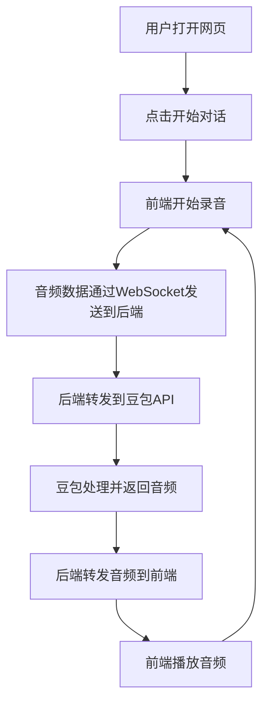
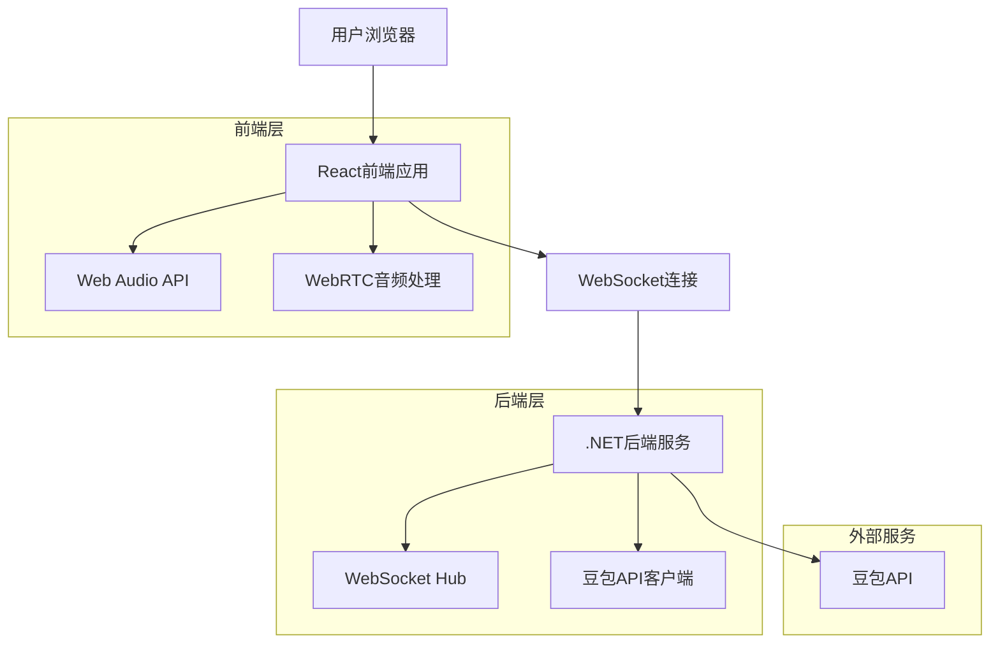
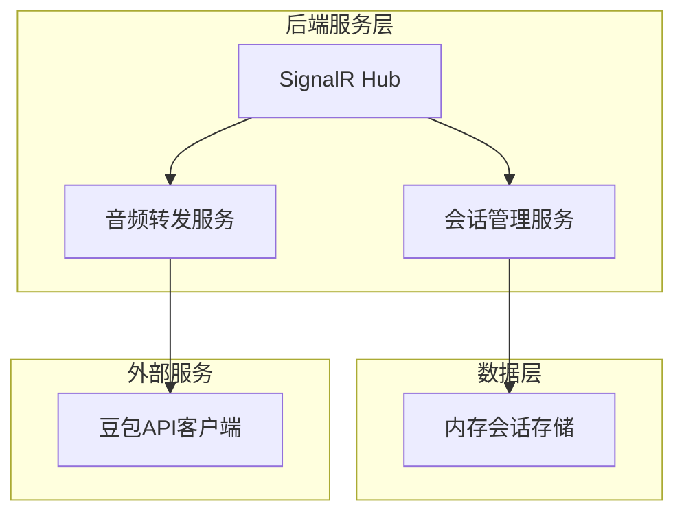

# 前后端分离实时对话系统架构设计

## 1. 产品概述

本方案将原有的.NET单体实时对话系统重构为前后端分离架构，前端React项目负责音频录制和播放，后端.NET项目专注于与豆包API的数据传输。通过WebSocket实现前后端实时通信，完全摆脱NAudio等本地音频库依赖，实现跨平台部署。

## 2. 核心功能

### 2.1 用户角色

| 角色   | 访问方式  | 核心权限             |
| ---- | ----- | ---------------- |
| 普通用户 | 浏览器访问 | 可进行实时语音对话，查看对话历史 |

### 2.2 功能模块

我们的实时对话系统包含以下主要页面：

1. **主页面**：对话界面、音频控制、状态显示
2. **设置页面**：音频参数配置、API配置

### 2.3 页面详情

| 页面名称 | 模块名称  | 功能描述                 |
| ---- | ----- | -------------------- |
| 主页面  | 对话界面  | 显示对话历史、实时文本转录、状态指示器  |
| 主页面  | 音频控制  | 开始/停止录音按钮、音量指示器、播放控制 |
| 主页面  | 状态显示  | 连接状态、录音状态、播放状态、错误提示  |
| 设置页面 | 音频配置  | 采样率设置、音频格式选择、设备选择    |
| 设置页面 | API配置 | 豆包API密钥配置、服务器地址设置    |

## 3. 核心流程

用户打开网页后，点击开始对话按钮，前端开始录音并通过WebSocket将音频数据发送到后端，后端转发给豆包API进行处理，豆包返回的音频数据通过后端转发给前端进行播放，形成完整的实时对话循环。



## 4. 用户界面设计

### 4.1 设计风格

* 主色调：#2563eb（蓝色）、#f8fafc（浅灰背景）

* 按钮样式：圆角按钮，悬停效果

* 字体：系统默认字体，16px主要文本，14px辅助文本

* 布局风格：卡片式布局，响应式设计

* 图标风格：简洁的线性图标，支持状态变化动画

### 4.2 页面设计概览

| 页面名称 | 模块名称 | UI元素                              |
| ---- | ---- | --------------------------------- |
| 主页面  | 对话界面 | 聊天气泡样式，左侧用户消息（蓝色），右侧AI回复（灰色），滚动区域 |
| 主页面  | 音频控制 | 大型圆形录音按钮（红色录音/绿色停止），音量波形显示，状态指示灯  |
| 设置页面 | 配置面板 | 表单样式，输入框和下拉选择，保存按钮，重置按钮           |

### 4.3 响应式设计

采用移动优先的响应式设计，支持桌面和移动设备，优化触摸交互体验。

## 5. 技术架构

### 5.1 架构设计



### 5.2 技术栈描述

* 前端：React\@18 + TypeScript + Tailwind CSS + Vite

* 后端：ASP.NET Core\@8 + SignalR

* 通信协议：WebSocket (SignalR)

* 音频处理：Web Audio API + MediaRecorder API

### 5.3 路由定义

| 路由        | 用途              |
| --------- | --------------- |
| /         | 主页面，实时对话界面      |
| /settings | 设置页面，配置音频和API参数 |

### 5.4 WebSocket通信协议

#### 5.4.1 前端到后端消息

**开始对话**

```typescript
interface StartConversationMessage {
  type: 'start_conversation';
  sessionId: string;
  audioConfig: {
    sampleRate: number;
    channels: number;
    format: 'float32' | 'int16';
  };
}
```

**音频数据**

```typescript
interface AudioDataMessage {
  type: 'audio_data';
  sessionId: string;
  audioData: ArrayBuffer; // Float32Array音频数据
  timestamp: number;
}
```

**停止对话**

```typescript
interface StopConversationMessage {
  type: 'stop_conversation';
  sessionId: string;
}
```

#### 5.4.2 后端到前端消息

**连接确认**

```typescript
interface ConnectionConfirmMessage {
  type: 'connection_confirm';
  sessionId: string;
  status: 'connected' | 'error';
}
```

**音频响应**

```typescript
interface AudioResponseMessage {
  type: 'audio_response';
  sessionId: string;
  audioData: ArrayBuffer; // Float32Array音频数据
  timestamp: number;
}
```

**文本转录**

```typescript
interface TranscriptionMessage {
  type: 'transcription';
  sessionId: string;
  text: string;
  isUser: boolean;
}
```

**状态更新**

```typescript
interface StatusMessage {
  type: 'status';
  sessionId: string;
  status: 'listening' | 'processing' | 'speaking' | 'idle';
}
```

### 5.5 后端服务架构



### 5.6 数据模型

#### 5.6.1 会话模型

```typescript
interface ConversationSession {
  sessionId: string;
  userId?: string;
  startTime: Date;
  lastActivity: Date;
  status: 'active' | 'inactive' | 'ended';
  audioConfig: AudioConfig;
}

interface AudioConfig {
  sampleRate: number;
  channels: number;
  format: 'float32' | 'int16';
  bufferSize: number;
}
```

## 6. 实现细节

### 6.1 前端音频处理

**录音实现**

```typescript
class AudioRecorder {
  private mediaRecorder: MediaRecorder;
  private audioContext: AudioContext;
  private processor: ScriptProcessorNode;
  
  async startRecording(onAudioData: (data: Float32Array) => void) {
    const stream = await navigator.mediaDevices.getUserMedia({ audio: true });
    this.audioContext = new AudioContext({ sampleRate: 24000 });
    
    // 实时音频数据处理
    this.processor = this.audioContext.createScriptProcessor(1024, 1, 1);
    this.processor.onaudioprocess = (event) => {
      const inputData = event.inputBuffer.getChannelData(0);
      onAudioData(new Float32Array(inputData));
    };
  }
}
```

**播放实现**

```typescript
class AudioPlayer {
  private audioContext: AudioContext;
  private gainNode: GainNode;
  
  constructor() {
    this.audioContext = new AudioContext({ sampleRate: 24000 });
    this.gainNode = this.audioContext.createGain();
    this.gainNode.connect(this.audioContext.destination);
  }
  
  playAudio(audioData: Float32Array) {
    const buffer = this.audioContext.createBuffer(1, audioData.length, 24000);
    buffer.copyToChannel(audioData, 0);
    
    const source = this.audioContext.createBufferSource();
    source.buffer = buffer;
    source.connect(this.gainNode);
    source.start();
  }
}
```

### 6.2 后端服务实现

**SignalR Hub**

```csharp
public class ConversationHub : Hub
{
    private readonly IConversationService _conversationService;
    
    public async Task StartConversation(StartConversationMessage message)
    {
        var session = await _conversationService.CreateSessionAsync(message.SessionId, message.AudioConfig);
        await Groups.AddToGroupAsync(Context.ConnectionId, message.SessionId);
        await Clients.Caller.SendAsync("ConnectionConfirm", new { SessionId = message.SessionId, Status = "connected" });
    }
    
    public async Task SendAudioData(AudioDataMessage message)
    {
        await _conversationService.ProcessAudioAsync(message.SessionId, message.AudioData);
    }
}
```

**豆包API集成**

```csharp
public class DoubaoApiService
{
    private ClientWebSocket _webSocket;
    
    public async Task SendAudioAsync(string sessionId, byte[] audioData)
    {
        var message = new
        {
            type = "audio",
            session_id = sessionId,
            audio_data = Convert.ToBase64String(audioData)
        };
        
        var json = JsonSerializer.Serialize(message);
        var buffer = Encoding.UTF8.GetBytes(json);
        await _webSocket.SendAsync(buffer, WebSocketMessageType.Text, true, CancellationToken.None);
    }
}
```

## 7. 部署方案

### 7.1 开发环境

* 前端：`npm run dev` (Vite开发服务器)

* 后端：`dotnet run` (ASP.NET Core开发服务器)

* 跨域配置：后端配置CORS允许前端域名

### 7.2 生产环境

* 前端：构建静态文件部署到CDN或静态服务器

* 后端：部署到云服务器或容器平台

* HTTPS：必须使用HTTPS以支持Web Audio API

* WebSocket：配置负载均衡支持WebSocket连接

## 8. 优势分析

### 8.1 跨平台支持

* 完全基于Web标准，支持所有现代浏览器

* 无需安装本地应用，即开即用

* 移动设备友好，支持触摸操作

### 8.2 技术优势

* 前后端分离，便于独立开发和部署

* 使用Web Audio API，性能优于传统音频库

* SignalR提供可靠的实时通信

* TypeScript提供类型安全

### 8.3 维护优势

* 去除NAudio依赖，减少平台兼容性问题

* 前端可独立更新UI和音频处理逻辑

* 后端专注业务逻辑，代码更简洁

* 便于水平扩展和负载均衡

