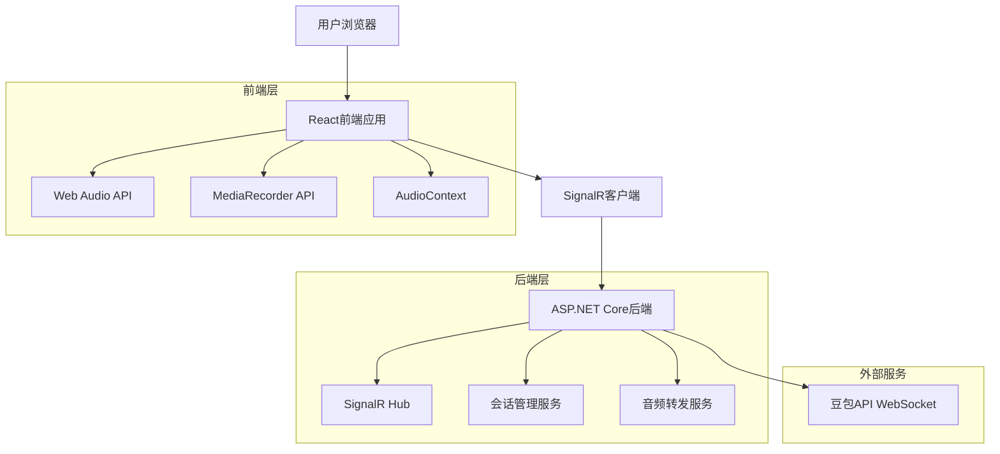
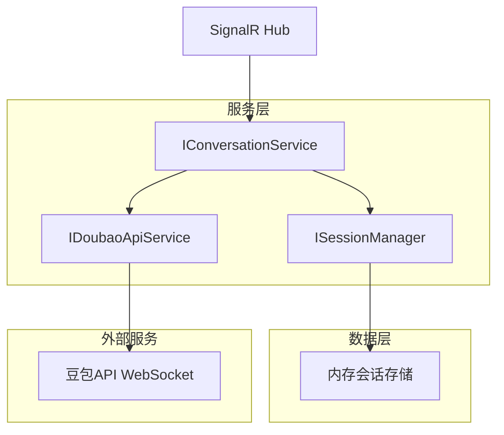
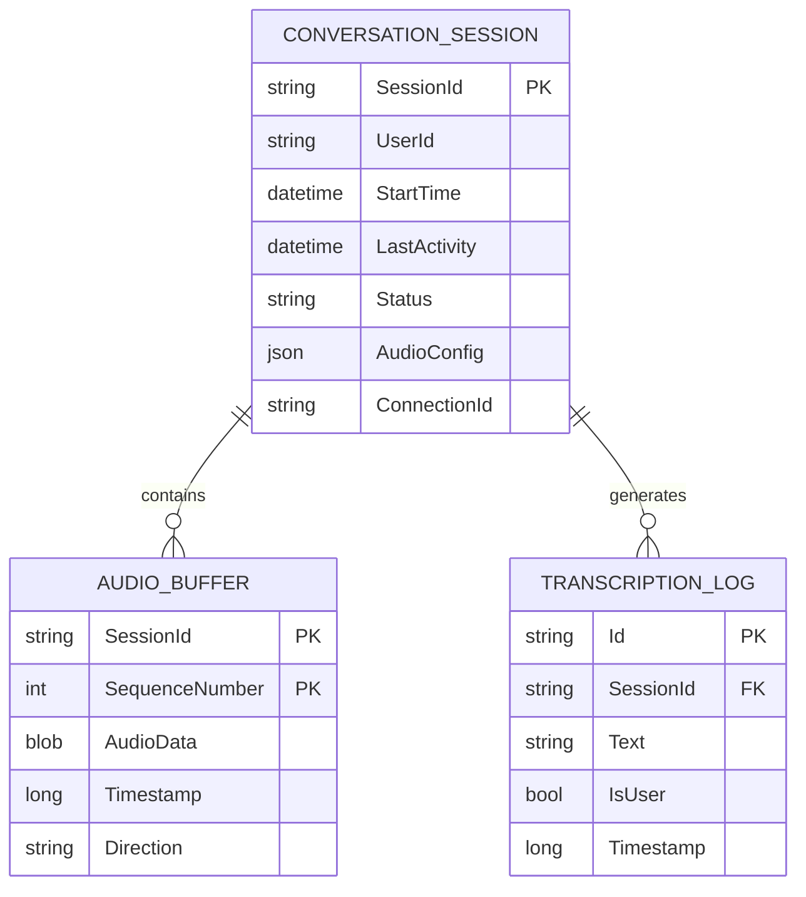

# 前后端分离实时对话系统技术架构文档

## 1. 架构设计



## 2. 技术描述

* 前端：React\@18 + TypeScript + Tailwind CSS + Vite + @microsoft/signalr

* 后端：ASP.NET Core\@8 + SignalR + System.ClientModel

* 通信协议：SignalR over WebSocket

* 音频处理：Web Audio API + MediaRecorder API

## 3. 路由定义

| 路由        | 用途            |
| --------- | ------------- |
| /         | 主页面，实时对话界面    |
| /settings | 设置页面，音频和API配置 |

## 4. SignalR Hub定义

### 4.1 Hub接口

**客户端到服务器方法**

```csharp
public class ConversationHub : Hub
{
    // 开始对话会话
    public async Task StartConversation(StartConversationRequest request)
    {
        // 创建会话并连接豆包API
    }
    
    // 发送音频数据
    public async Task SendAudioData(AudioDataRequest request)
    {
        // 转发音频数据到豆包API
    }
    
    // 停止对话
    public async Task StopConversation(string sessionId)
    {
        // 结束会话并断开豆包API连接
    }
    
    // 获取会话状态
    public async Task GetSessionStatus(string sessionId)
    {
        // 返回当前会话状态
    }
}
```

**服务器到客户端方法**

```typescript
// 前端SignalR客户端接收的方法
interface IConversationClient {
  // 连接确认
  ConnectionConfirm(response: ConnectionConfirmResponse): void;
  
  // 接收音频数据
  ReceiveAudioData(response: AudioDataResponse): void;
  
  // 接收转录文本
  ReceiveTranscription(response: TranscriptionResponse): void;
  
  // 状态更新
  StatusUpdate(response: StatusUpdateResponse): void;
  
  // 错误通知
  ErrorNotification(response: ErrorResponse): void;
}
```

### 4.2 请求响应模型

**开始对话请求**

```csharp
public class StartConversationRequest
{
    public string SessionId { get; set; }
    public AudioConfig AudioConfig { get; set; }
    public string? UserId { get; set; }
}

public class AudioConfig
{
    public int SampleRate { get; set; } = 24000;
    public int Channels { get; set; } = 1;
    public string Format { get; set; } = "float32";
    public int BufferSize { get; set; } = 1024;
}
```

**音频数据请求**

```csharp
public class AudioDataRequest
{
    public string SessionId { get; set; }
    public byte[] AudioData { get; set; }
    public long Timestamp { get; set; }
    public int SequenceNumber { get; set; }
}
```

**连接确认响应**

```csharp
public class ConnectionConfirmResponse
{
    public string SessionId { get; set; }
    public string Status { get; set; } // "connected" | "error"
    public string? ErrorMessage { get; set; }
    public AudioConfig AudioConfig { get; set; }
}
```

**音频数据响应**

```csharp
public class AudioDataResponse
{
    public string SessionId { get; set; }
    public byte[] AudioData { get; set; }
    public long Timestamp { get; set; }
    public int SequenceNumber { get; set; }
}
```

**转录响应**

```csharp
public class TranscriptionResponse
{
    public string SessionId { get; set; }
    public string Text { get; set; }
    public bool IsUser { get; set; }
    public long Timestamp { get; set; }
}
```

**状态更新响应**

```csharp
public class StatusUpdateResponse
{
    public string SessionId { get; set; }
    public string Status { get; set; } // "listening" | "processing" | "speaking" | "idle"
    public Dictionary<string, object>? Metadata { get; set; }
}
```

## 5. 后端服务架构



### 5.1 核心服务接口

**会话管理服务**

```csharp
public interface ISessionManager
{
    Task<ConversationSession> CreateSessionAsync(string sessionId, AudioConfig audioConfig, string? userId = null);
    Task<ConversationSession?> GetSessionAsync(string sessionId);
    Task UpdateSessionStatusAsync(string sessionId, SessionStatus status);
    Task RemoveSessionAsync(string sessionId);
    Task<bool> IsSessionActiveAsync(string sessionId);
}
```

**豆包API服务**

```csharp
public interface IDoubaoApiService
{
    Task<bool> ConnectAsync(string sessionId, AudioConfig audioConfig);
    Task SendAudioDataAsync(string sessionId, byte[] audioData, long timestamp);
    Task DisconnectAsync(string sessionId);
    event EventHandler<AudioDataReceivedEventArgs> AudioDataReceived;
    event EventHandler<TranscriptionReceivedEventArgs> TranscriptionReceived;
    event EventHandler<StatusChangedEventArgs> StatusChanged;
}
```

**对话服务**

```csharp
public interface IConversationService
{
    Task<ConnectionConfirmResponse> StartConversationAsync(StartConversationRequest request);
    Task ProcessAudioDataAsync(AudioDataRequest request);
    Task<StatusUpdateResponse> StopConversationAsync(string sessionId);
    Task<StatusUpdateResponse> GetSessionStatusAsync(string sessionId);
}
```

## 6. 数据模型

### 6.1 数据模型定义



### 6.2 实体类定义

**会话实体**

```csharp
public class ConversationSession
{
    public string SessionId { get; set; }
    public string? UserId { get; set; }
    public DateTime StartTime { get; set; }
    public DateTime LastActivity { get; set; }
    public SessionStatus Status { get; set; }
    public AudioConfig AudioConfig { get; set; }
    public string ConnectionId { get; set; }
    public ClientWebSocket? DoubaoWebSocket { get; set; }
}

public enum SessionStatus
{
    Initializing,
    Active,
    Listening,
    Processing,
    Speaking,
    Idle,
    Ended,
    Error
}
```

**音频缓冲区**

```csharp
public class AudioBuffer
{
    public string SessionId { get; set; }
    public int SequenceNumber { get; set; }
    public byte[] AudioData { get; set; }
    public long Timestamp { get; set; }
    public AudioDirection Direction { get; set; }
}

public enum AudioDirection
{
    Incoming, // 从前端接收
    Outgoing  // 发送到前端
}
```

## 7. 前端技术实现

### 7.1 SignalR客户端配置

```typescript
import { HubConnectionBuilder, HubConnection, LogLevel } from '@microsoft/signalr';

class ConversationClient {
  private connection: HubConnection;
  
  constructor(serverUrl: string) {
    this.connection = new HubConnectionBuilder()
      .withUrl(`${serverUrl}/conversationHub`)
      .withAutomaticReconnect()
      .configureLogging(LogLevel.Information)
      .build();
      
    this.setupEventHandlers();
  }
  
  private setupEventHandlers() {
    this.connection.on('ConnectionConfirm', (response: ConnectionConfirmResponse) => {
      this.onConnectionConfirm(response);
    });
    
    this.connection.on('ReceiveAudioData', (response: AudioDataResponse) => {
      this.onAudioDataReceived(response);
    });
    
    this.connection.on('ReceiveTranscription', (response: TranscriptionResponse) => {
      this.onTranscriptionReceived(response);
    });
    
    this.connection.on('StatusUpdate', (response: StatusUpdateResponse) => {
      this.onStatusUpdate(response);
    });
  }
  
  async startConversation(request: StartConversationRequest): Promise<void> {
    await this.connection.invoke('StartConversation', request);
  }
  
  async sendAudioData(request: AudioDataRequest): Promise<void> {
    await this.connection.invoke('SendAudioData', request);
  }
}
```

### 7.2 音频处理实现

```typescript
class WebAudioManager {
  private audioContext: AudioContext;
  private mediaRecorder: MediaRecorder;
  private recordingStream: MediaStream;
  private processor: ScriptProcessorNode;
  private isRecording = false;
  
  constructor(private onAudioData: (data: Float32Array) => void) {
    this.audioContext = new AudioContext({ sampleRate: 24000 });
  }
  
  async startRecording(): Promise<void> {
    this.recordingStream = await navigator.mediaDevices.getUserMedia({
      audio: {
        sampleRate: 24000,
        channelCount: 1,
        echoCancellation: true,
        noiseSuppression: true
      }
    });
    
    const source = this.audioContext.createMediaStreamSource(this.recordingStream);
    this.processor = this.audioContext.createScriptProcessor(1024, 1, 1);
    
    this.processor.onaudioprocess = (event) => {
      if (this.isRecording) {
        const inputData = event.inputBuffer.getChannelData(0);
        this.onAudioData(new Float32Array(inputData));
      }
    };
    
    source.connect(this.processor);
    this.processor.connect(this.audioContext.destination);
    this.isRecording = true;
  }
  
  stopRecording(): void {
    this.isRecording = false;
    if (this.processor) {
      this.processor.disconnect();
    }
    if (this.recordingStream) {
      this.recordingStream.getTracks().forEach(track => track.stop());
    }
  }
  
  playAudio(audioData: Float32Array): void {
    const buffer = this.audioContext.createBuffer(1, audioData.length, 24000);
    buffer.copyToChannel(audioData, 0);
    
    const source = this.audioContext.createBufferSource();
    source.buffer = buffer;
    source.connect(this.audioContext.destination);
    source.start();
  }
}
```

## 8. 部署配置

### 8.1 后端配置

**Program.cs**

```csharp
var builder = WebApplication.CreateBuilder(args);

// 添加服务
builder.Services.AddSignalR();
builder.Services.AddCors(options =>
{
    options.AddPolicy("AllowFrontend", policy =>
    {
        policy.WithOrigins("http://localhost:3000", "https://yourdomain.com")
              .AllowAnyHeader()
              .AllowAnyMethod()
              .AllowCredentials();
    });
});

builder.Services.AddScoped<IConversationService, ConversationService>();
builder.Services.AddSingleton<ISessionManager, InMemorySessionManager>();
builder.Services.AddScoped<IDoubaoApiService, DoubaoApiService>();

var app = builder.Build();

// 配置管道
app.UseCors("AllowFrontend");
app.MapHub<ConversationHub>("/conversationHub");

app.Run();
```

### 8.2 前端配置

**vite.config.ts**

```typescript
import { defineConfig } from 'vite';
import react from '@vitejs/plugin-react';

export default defineConfig({
  plugins: [react()],
  server: {
    port: 3000,
    proxy: {
      '/conversationHub': {
        target: 'http://localhost:5000',
        ws: true,
        changeOrigin: true
      }
    }
  },
  build: {
    target: 'es2020'
  }
});
```

### 8.3 Docker部署

**后端Dockerfile**

```dockerfile
FROM mcr.microsoft.com/dotnet/aspnet:8.0 AS base
WORKDIR /app
EXPOSE 80
EXPOSE 443

FROM mcr.microsoft.com/dotnet/sdk:8.0 AS build
WORKDIR /src
COPY ["RealtimeDialog.Api/RealtimeDialog.Api.csproj", "RealtimeDialog.Api/"]
RUN dotnet restore "RealtimeDialog.Api/RealtimeDialog.Api.csproj"
COPY . .
WORKDIR "/src/RealtimeDialog.Api"
RUN dotnet build "RealtimeDialog.Api.csproj" -c Release -o /app/build

FROM build AS publish
RUN dotnet publish "RealtimeDialog.Api.csproj" -c Release -o /app/publish

FROM base AS final
WORKDIR /app
COPY --from=publish /app/publish .
ENTRYPOINT ["dotnet", "RealtimeDialog.Api.dll"]
```

**前端Dockerfile**

```dockerfile
FROM node:18-alpine AS build
WORKDIR /app
COPY package*.json ./
RUN npm ci
COPY . .
RUN npm run build

FROM nginx:alpine
COPY --from=build /app/dist /usr/share/nginx/html
COPY nginx.conf /etc/nginx/nginx.conf
EXPOSE 80
CMD ["nginx", "-g", "daemon off;"]
```

**docker-compose.yml**

```yaml
version: '3.8'
services:
  frontend:
    build:
      context: ./frontend
      dockerfile: Dockerfile
    ports:
      - "3000:80"
    depends_on:
      - backend
      
  backend:
    build:
      context: ./backend
      dockerfile: Dockerfile
    ports:
      - "5000:80"
    environment:
      - ASPNETCORE_ENVIRONMENT=Production
      - DoubaoApi__Endpoint=wss://openspeech.bytedance.com/api/v1/tts
      - DoubaoApi__ApiKey=${DOUBAO_API_KEY}
```

